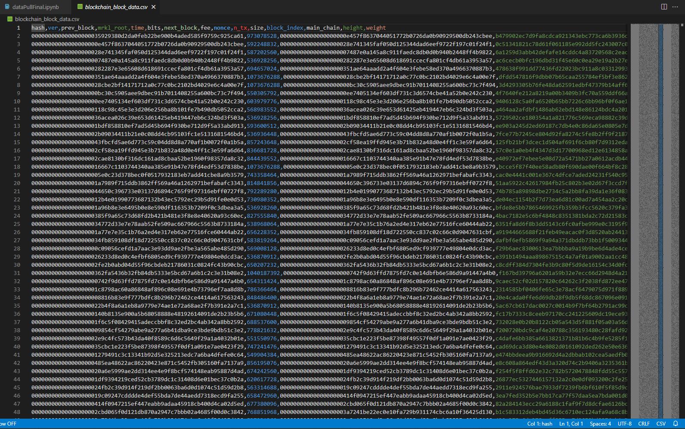
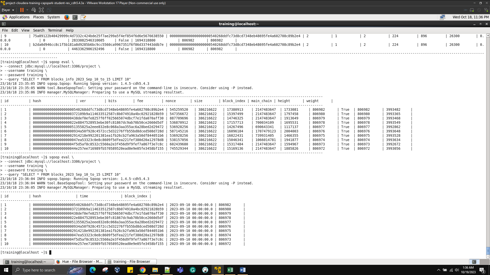

# BigDataStocksInsights
"A centralized repository for comprehensive big data analytics and insights into the dynamic world of stock markets. Discover powerful data-driven strategies and deep market insights to make informed decisions and stay ahead in the ever-evolving realm of financial investments."
This project 📊 focuses on the comprehensive ingestion and analysis of large-scale stock market data using the Hadoop ecosystem. The workflow is designed to cover data ingestion from various sources, including direct file transfer, stream ingestion through Apache Flume, and data ingestion using Sqoop. Furthermore, the project includes detailed data analysis using Pig 🐷 and Hive/Impala 🐝 to derive meaningful insights from the ingested datasets.

🔧 Project Structure

The project is divided into the following major steps:

### VM Setup 🖥️

This initial step involves setting up the virtual machine (VM) and configuring it for the subsequent data ingestion and analysis tasks. It includes instructions for setting up Hadoop services, changing the Python default interpreter, and installing necessary packages.

- **Hadoop:** Setting up the Hadoop ecosystem for data processing and storage.
- **Python 2.7:** Changing the default Python interpreter for compatibility.
- **Pip:** Upgrading the pip package manager for Python.

### Data Ingestion 📥

This step covers the ingestion of data from different sources into HDFS using various methods and tools from the Hadoop ecosystem. It involves direct file transfer, stream ingestion using Apache Flume, Python, and data ingestion using Sqoop.

- **Apache Flume:** Stream ingestion tool for collecting and transferring real-time data.
- **Python Libraries:** Utilizing various Python libraries such as requests, datetime, json, and socket for data retrieval and transfer.
- **Sqoop:** Ingesting data from external sources like MySQL directly into Hadoop.

### Data Analysis 📈

In this step, the ingested data is analyzed using Pig and Hive/Impala to derive valuable insights. The analysis includes tasks such as summarizing the dataset, querying specific information, and extracting meaningful statistics from the data.

- **Pig Latin:** Analyzing large datasets in Hadoop using the Pig tool for data flow and processing.
- **Hive/Impala:** Querying and analyzing structured data in Hadoop through a SQL-like interface.
- **MySQL:** Relational database management system for storing and managing structured data.

